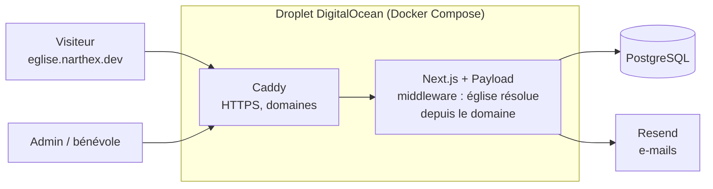

# Narthex

Plateforme tout-en-un pour les églises : chaque église obtient son propre site public et un espace de gestion (membres, événements, cultes, prédications), le tout servi par une seule application multi-tenant.

**État** : en phase de test. Une église teste actuellement la plateforme en conditions réelles. La page [narthex.dev](https://narthex.dev) présente le projet.

<!-- À COMPLÉTER : une capture du dashboard et une du site public d'une église, ex. docs/screenshots/dashboard.png -->

## Fonctionnalités

- **Site public par église**, sur un sous-domaine ou un domaine personnalisé : présentation, événements, prédications, annonces, page « nous rendre visite », formulaire de contact.
- **Espace de gestion** :
  - membres (fiches, import CSV, invitations par e-mail) et groupes ;
  - événements et rassemblements, réservation de salles avec alerte de conflit d'horaire ;
  - planning des cultes (rôles par culte, verrou d'édition, planning partagé) et feuille d'annonces ;
  - prédications avec fichiers audio, documents partagés ;
  - identité visuelle de chaque église (logo, couleurs) appliquée à son site.
- **Trois rôles** : super-admin de la plateforme, admin d'église, bénévole. Les droits sont vérifiés côté serveur, collection par collection.

## Stack

| | |
|---|---|
| Application | Next.js (App Router), React, TypeScript |
| CMS / back-office | Payload CMS 3, plugin multi-tenant, éditeur Lexical |
| Base de données | PostgreSQL |
| UI | Tailwind CSS, Radix UI, Framer Motion |
| E-mails | Resend |
| Tests | Vitest (intégration), Playwright (E2E et parcours par rôle) |
| Déploiement | Docker multi-étapes, GitHub Actions, GitHub Container Registry, Caddy (HTTPS), droplet DigitalOcean |

## Architecture



- **Multi-tenant** : un middleware Next.js identifie l'église à partir du sous-domaine ou du domaine personnalisé, puis le plugin multi-tenant de Payload limite chaque requête aux données de cette église.
- **Isolation des données** : les relations entre documents sont verrouillées à l'église du document, et les uploads et les comptes sont isolés par église.
- **Sécurité** : limitation de débit sur les routes sensibles (connexion, mot de passe oublié, invitations, API), CORS et CSRF limités aux domaines déclarés.

## Déploiement continu

À chaque push sur `master`, GitHub Actions :

1. construit l'image Docker et la publie sur GitHub Container Registry ;
2. se connecte en SSH au droplet ;
3. récupère la nouvelle image et redémarre le service avec Docker Compose.

## Tests

```bash
pnpm test:int   # tests d'intégration (Vitest)
pnpm test:e2e   # tests end-to-end (Playwright)
```

Les tests par rôle (`tests/roles/`) rejouent les parcours d'un visiteur anonyme, d'un bénévole et d'un admin d'église, et vérifient ce que chacun peut voir et modifier.

## Lancer en local

Prérequis : Node.js 20, pnpm, une base PostgreSQL.

```bash
cp .env.example .env    # renseigner DATABASE_URL et PAYLOAD_SECRET
pnpm install
pnpm dev                # http://localhost:3000, admin sur /admin
```

Pour tester un site d'église en local : `http://<slug-eglise>.localhost:3000`.

## Documentation de conception

Le cadrage du projet est dans [`docs/planning-artifacts`](docs/planning-artifacts) : PRD, architecture et découpage en epics.

## Auteur

Conçu et développé par [Matthias Germain](https://github.com/MatthiasGermain).
